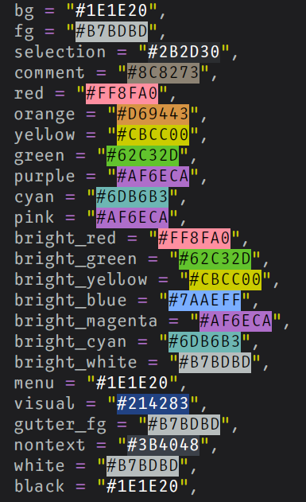

## ✔️ Requirements

- Neovim >= 0.8.0
- Treesitter (optional)

## #️ Supported Plugins

- [LSP](https://github.com/neovim/nvim-lspconfig)
- [Treesitter](https://github.com/nvim-treesitter/nvim-treesitter)
- [nvim-compe](https://github.com/hrsh7th/nvim-compe)
- [nvim-cmp](https://github.com/hrsh7th/nvim-cmp)
- [Telescope](https://github.com/nvim-telescope/telescope.nvim)
- [NvimTree](https://github.com/kyazdani42/nvim-tree.lua)
- [NeoTree](https://github.com/nvim-neo-tree/neo-tree.nvim)
- [BufferLine](https://github.com/akinsho/nvim-bufferline.lua)
- [Git Signs](https://github.com/lewis6991/gitsigns.nvim)
- [Lualine](https://github.com/hoob3rt/lualine.nvim)
- [LSPSaga](https://github.com/glepnir/lspsaga.nvim)
- [indent-blankline](https://github.com/lukas-reineke/indent-blankline.nvim)
- [nvim-ts-rainbow](https://github.com/p00f/nvim-ts-rainbow)
- [nvim-dap-ui](https://github.com/rcarriga/nvim-dap-ui)

## ⬇️ Installation

Install via package manager

```lua
-- Using Packer:
use 'ousatov-ua/monoflow.nvim'
```

```vim
" Using Vim-Plug:
Plug 'ousatov-ua/monoflow.nvim'
```

## 🚀 Usage

```lua
-- Lua:
vim.cmd[[colorscheme monoflow]]
```

```vim
" Vim-Script:
colorscheme monoflow
```

If you are using [`lualine`](https://github.com/hoob3rt/lualine.nvim), you can also enable the provided theme:

> Make sure to set theme as 'monoflow-nvim' as monoflow already exists in lualine built in themes

```lua
require('lualine').setup {
  options = {
    -- ...
    theme = 'monoflow-nvim'
    -- ...
  }
}
```

## 🔧 Configuration

The configuration must be run before `colorscheme` command to take effect.

If you're using Lua:

```lua
local monoflow = require("monoflow")
monoflow.setup({
    -- customize monoflow color palette
    return {
        bg = "#1E1E20",
        fg = "#B7BDBD",
        selection = "#44475A",
        comment = "#8C8273",
        red = "#FF8FA0",
        orange = "#D69443",
        yellow = "#CBCC00",
        green = "#62C32D",
        purple = "#AF6ECA",
        cyan = "#6DB6B3",
        pink = "#AF6ECA",
        bright_red = "#FF8FA0",
        bright_green = "#62C32D",
        bright_yellow = "#CBCC00",
        bright_blue = "#7AAEFF",
        bright_magenta = "#AF6ECA",
        bright_cyan = "#6DB6B3",
        bright_white = "#B7BDBD",
        menu = "#21222C",
        visual = "#3E4452",
        gutter_fg = "#4B5263",
        nontext = "#3B4048",
        white = "#B7BDBD",
        black = "#1E1E20",
    },
    -- show the '~' characters after the end of buffers
    show_end_of_buffer = true, -- default false
    -- use transparent background
    transparent_bg = true, -- default false
    -- set custom lualine background color
    lualine_bg_color = "#44475a", -- default nil
    -- set italic comment
    italic_comment = false, -- default true
    -- overrides the default highlights with table see `:h synIDattr`
    overrides = {},
    -- You can use overrides as table like this
    -- overrides = {
    --   NonText = { fg = "white" }, -- set NonText fg to white
    --   NvimTreeIndentMarker = { link = "NonText" }, -- link to NonText highlight
    --   Nothing = {} -- clear highlight of Nothing
    -- },
    -- Or you can also use it like a function to get color from theme
    -- overrides = function (colors)
    --   return {
    --     NonText = { fg = colors.white }, -- set NonText fg to white of theme
    --   }
    -- end,
})
```

## 🎨 Importing colors for other usage

```lua
local colors = require('monoflow').colors()
```

This will return the following table (`monoflow` palette shown):

